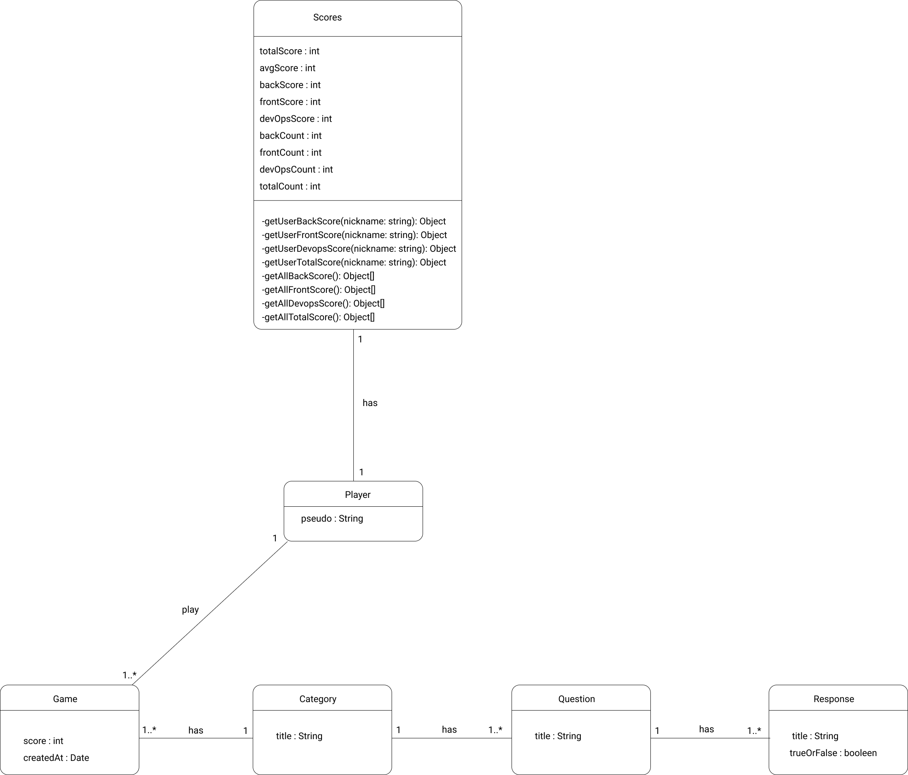

# Projet-08-Hackathon-13-17-Dec-Gp-Ananas-Front <!-- omit in toc -->

📚 Le projet (Front) est disponible au lien suivant : <https://gitlab.com/formation-cda1/projet-08-hackathon-13-17-dec-gp-ananas-front.git>

Groupe Ananas 🍍 :

- Ailine
- Gwen
- Nassim
- Andria

## Tables des matières <!-- omit in toc -->
- [Introduction](#introduction)
- [Diagramme de classe - UML](#diagramme-de-classe---uml)
- [Wireframes Desktop et Mobile](#wireframes-desktop-et-mobile)
  - [Wireframes Desktop](#wireframes-desktop)
  - [Wireframes Mobile](#wireframes-mobile)
  - [DevOps](#devops)
## Introduction

Ce fichier présentera un récapitulatif du travail réalisé pour le projet Hackaton.

## Diagramme de classe - UML

Ci dessous est présenté le diagramme de classe UML :

## Wireframes Desktop et Mobile

[Lien vers Figma](https://www.figma.com/file/0mniBudedOXDnHA4qsGtnW/Ananas?node-id=24%3A40)
### Wireframes Desktop

[Lien vers Figma](https://www.figma.com/file/0mniBudedOXDnHA4qsGtnW/Ananas?node-id=24%3A40)
### Wireframes Mobile

[Lien vers Figma](https://www.figma.com/file/0mniBudedOXDnHA4qsGtnW/Ananas?node-id=24%3A40)

### DevOps 

Lien vers l'application : https://quizz-game.andriacapai.com

Lien vers l'api : https://api.quizz-game.andriacapai.com/v1/

Mise en place de l'intégration continue avec gitlab.
